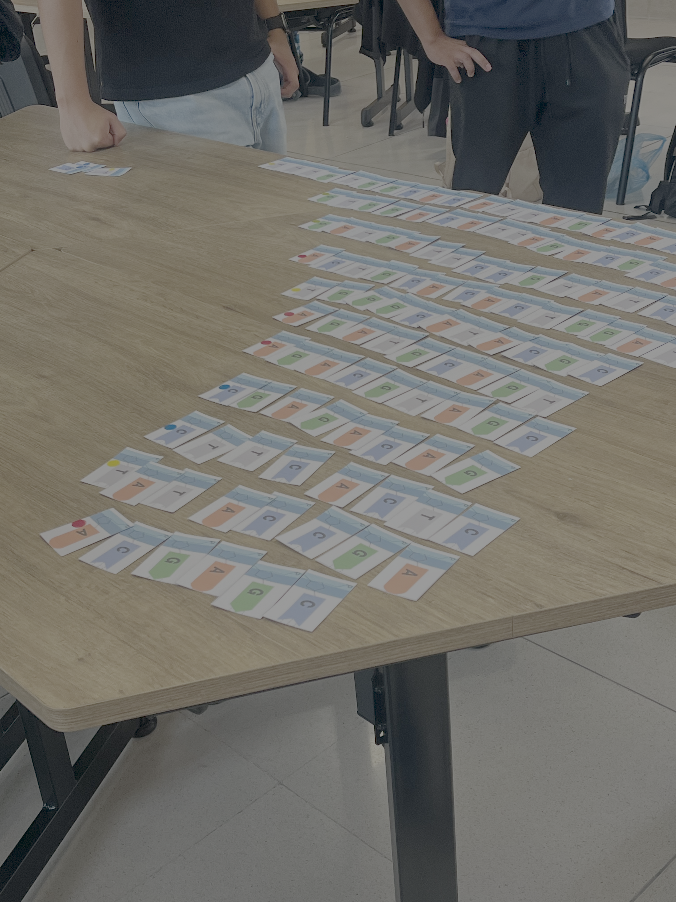

# Actividad 1

## Tecnologías de Secuenciamiento

-   **Primera generación (\~1970s):** Método Maxam-Gilbert (base química, electroforesis en gel) y método Sanger
-   **Sanger (primera generación consolidada):**
    -   Utiliza dideoxinucleótidos (ddNTPs) que carecen del grupo OH en la pentosa, impidiendo la elongación de la cadena
    -   Versión moderna agrega fluoróforos de colores distintos para cada nucleótido, detectados por láser
    -   Separación por electroforesis capilar; lectura mediante cromatograma
    -   Limitante: máximo \~1,500 pares de bases; requiere DNA puro de una sola especie
    -   Distribuido por Applied Biosystems
-   **Segunda generación / NGS (\~2000s–2010s):**
    -   **Illumina:** PCR de puente en una placa con millones de clusters; secuenciamiento por síntesis con fluoróforos; lecturas forward y reverse; \~150–300 pb por lectura; muy alta confiabilidad
    -   **Ion Torrent:** Detecta cambios de pH al incorporar nucleótidos (protones liberados), usando un chip semiconductor; sin fluoróforos; mayor tasa de error (\~1–1.7%); más rápido y económico pero menos confiable para mutaciones puntuales
    -   **SOLiD y 454 Titanium:** También NGS, con menor adopción en el mercado
-   **Tercera generación:**
    -   **PacBio HiFi:** Secuenciamiento de molécula única en tiempo real; lecturas de 15,000–50,000 pb; \>99.9% de precisión por lecturas repetidas del mismo fragmento; sin amplificación por PCR; captura información epigenética; útil para regiones ricas en GC, variantes estructurales e intrones; más caro y menos disponible en México
    -   **Oxford Nanopore:** Detecta cambios de corriente eléctrica al pasar el DNA por un nanoporo proteico; portátil (dispositivo MinION del tamaño de un celular); mayor tasa de error; modelo de negocio basado en venta de reactivos

| Búsqueda en Google Académico | Resultados aproximados | \%     |
|------------------------------|------------------------|--------|
| `sanger sequencing`          | 624,000                | 41.95% |
| `illumina sequencing`        | 634,000                | 42.63% |
| `ion torrent sequencing`     | 66,100                 | 4.44%  |
| `pacbio sequencing`          | 77,600                 | 5.22%  |
| `Oxford nanopore sequencing` | 85,700                 | 5.76%  |

### Actividad

Para la actividad de las tecnologias de sucuenciamiento ocupamos tarjetas con nucleotidos, estampas para los fluoroforos, y tarjetas de dideoxinucleotidos. Las ocupamos para simular que hacen las tecnicas de secuenciamiento sanger y Illumina.

# Actividad 2

## Identificación de los valores de calidad de secuencias
### Formato FASTQ

- Formato estándar de entrega de resultados para Illumina, PacBio, Oxford Nanopore y otras tecnologías NGS (Sanger usa formato .ab1)
- Cada secuencia ocupa **4 líneas:**
    1. Identificador (comienza con `@`)
    2. Secuencia de nucleótidos
    3. Separador (`+`)
    4. Valores de calidad (Q-score en codificación ASCII-33)
- **Escala de calidad (Phred/Q-score):**
    - Q10 = 90% de confiabilidad
    - Q20 = 99%
    - Q30 = 99.9%
    - Q40 = 99.99%
    - El valor promedio típico reportado en artículos es ~Q28
- Los extremos de las secuencias suelen tener menor calidad; se recomienda filtrar antes del análisi

