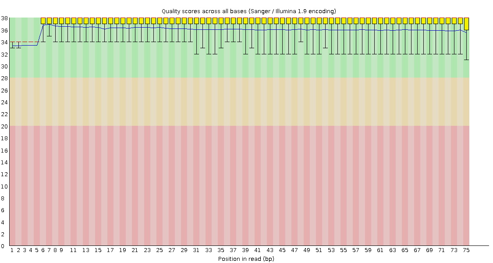

# Introducción

## Contexto biológico

El BioProject **PRJNA268110** (GEO: GSE63516) corresponde al estudio *"RNA-seq analysis of gene expression during and after exposure to hydroxyurea in WT and mec1 cells in Saccharomyces cerevisiae"*. El organismo estudiado es la levadura de cerveza *Saccharomyces cerevisiae* (NCBI Taxonomy ID: 4932), organismo modelo eucariota.

La hidroxiurea (HU) inhibe la ribonucleótido reductasa, lo que reduce los dNTPs y provoca estrés replicativo, con formación de DNA de cadena sencilla (ssDNA) en las horquillas de replicación. En levadura, el gen *MEC1* (ortólogo de ATR) es central en el *checkpoint* de replicación. Trabajo previo del grupo mostró que, al inactivar *MEC1*, los cromosomas se rompen en las horquillas de replicación tras una exposición transitoria a HU.

-   **Grupo responsable:** laboratorio de Wenyi Feng, Dept. de Bioquímica y Biología Molecular, SUNY Upstate Medical University (EE. UU.).
-   **Centro de depósito:** GEO.
-   **Fechas:** registro del proyecto 20-nov-2014; liberación pública de los datos de secuencia 13-ene-2015.
-   **Publicación asociada:** Hoffman EA *et al.*, "Break-seq reveals hydroxyurea-induced chromosome fragility as a result of unscheduled conflict between DNA replication and transcription", *Genome Research* 2015; 25(3):402–412.

## Pregunta biológica

Los autores se preguntaron si todas las horquillas de replicación con huecos de ssDNA tienen la misma probabilidad de producir rupturas de doble cadena (DSB) durante la recuperación de HU. Para ello desarrollaron Break-seq (marcaje de DSB + secuenciación) y complementaron con RNA-seq para conocer qué genes se inducen por HU. Su modelo propone que la fragilidad cromosómica surge cuando las horquillas desestabilizadas chocan con la maquinaria de transcripción en genes inducidos por HU.

## Diseño experimental

Se compararon células silvestres (*MEC1*) y mutantes *mec1*. Las células se sincronizaron en G1 con factor alfa y se tomaron muestras en cuatro puntos:

| Punto | Descripción                                     |
|-------|-------------------------------------------------|
| G1    | Células sincronizadas en G1                     |
| HU 1h | Liberadas de G1 a medio con 200 mM HU por 1 h   |
| R30   | Recuperación en medio fresco, 30 min tras el HU |
| R60   | Recuperación en medio fresco, 60 min tras el HU |

Con 2 genotipos (*wildtype* y *mec1*) × 4 puntos se obtienen **8 muestras**, que coinciden con los 8 *runs* analizados aquí (ver tabla de BioSample/Experiment/Run). En la nomenclatura de NCBI los puntos se llaman G1, HU, R30 y R60.

## Objetivo de este reporte

Reconstruir la información experimental del BioProject a partir de las bases de datos públicas, describir su organización jerárquica (BioProject → BioSample → Experiment → Run), descargar y explorar las lecturas crudas, evaluar su calidad con FastQC y recuperar el genoma de referencia de *S. cerevisiae*, de forma reproducible.

# Datos y metodología

## Fuentes de datos

| Fuente | Identificador | Uso |
|----|----|----|
| NCBI BioProject | PRJNA268110 | Descripción general del proyecto |
| GEO | GSE63516 | Metadatos de las muestras |
| SRA Study | SRP050091 | Agrupa los experimentos de secuenciación |
| NCBI SRA | SRR1658454 – SRR1658461 | Lecturas crudas |
| NCBI Datasets / RefSeq | GCF_000146045.2 | Genoma de referencia |

## Jerarquía de los datos

-   **BioProject:** unidad que agrupa todo un proyecto de investigación (objetivo, grupo, financiamiento). Aquí: PRJNA268110.
-   **BioSample:** descripción de la muestra biológica (organismo, cepa/genotipo, condición, tiempo). Una BioSample puede dar origen a varios experimentos.
-   **SRA Experiment (SRX):** un experimento de secuenciación de una BioSample: define la biblioteca (estrategia, fuente, selección, *layout*) y la plataforma/instrumento.
-   **SRA Run (SRR):** el resultado concreto de secuenciar un experimento, es decir, el conjunto de lecturas que se descarga. Un experimento puede tener varios *runs*.

Relación: `BioProject 1─n BioSample 1─n Experiment 1─n Run`.

## Metadatos de secuenciación

| Campo                       | Valor                 |
|-----------------------------|-----------------------|
| Assay type                  | RNA-Seq               |
| Plataforma                  | Illumina              |
| Instrumento                 | Illumina MiSeq        |
| Library source / selection  | TRANSCRIPTOMIC / cDNA |
| Library layout              | PAIRED                |
| Longitud de lectura nominal | 75 pb (paired-end)    |
| Librerías                   | Stranded mRNA         |
| Formatos disponibles        | fastq, run.zq, sra    |
| Consent / ReleaseDate       | public / 2015-01-13   |

## Tabla BioSample – Experiment – Run

Relación entre BioSample, Experiment y Run (obtenida del SRA Run Selector del BioProject, 8 elementos):

| BioSample | SRA Experiment | SRA Run | GEO Sample | Muestra (genotipo_condición) | Tipo de secuenciación | Layout |
|-----------|-----------|-----------|-----------|-----------|-----------|-----------|
| SAMN03203061 | SRX764815 | SRR1658454 | GSM1551456 | wildtype_G1 | RNA-Seq | PAIRED |
| SAMN03203063 | SRX764816 | SRR1658455 | GSM1551457 | wildtype_HU | RNA-Seq | PAIRED |
| SAMN03203066 | SRX764817 | SRR1658456 | GSM1551458 | wildtype_R30 | RNA-Seq | PAIRED |
| SAMN03203053 | SRX764818 | SRR1658457 | GSM1551459 | wildtype_R60 | RNA-Seq | PAIRED |
| SAMN03203062 | SRX764819 | SRR1658458 | GSM1551460 | mec1_G1 | RNA-Seq | PAIRED |
| SAMN03203059 | SRX764820 | SRR1658459 | GSM1551461 | mec1_HU | RNA-Seq | PAIRED |
| SAMN03203067 | SRX764821 | SRR1658460 | GSM1551462 | mec1_R30 | RNA-Seq | PAIRED |
| SAMN03203068 | SRX764822 | SRR1658461 | GSM1551463 | mec1_R60 | RNA-Seq | PAIRED |

## Herramientas utilizadas

| Herramienta | Versión | Función |
|------------------------|------------------------|------------------------|
| SRA Toolkit (`prefetch`, `fasterq-dump`) | 3.1.1 | Descarga y conversión SRA → FASTQ |
| NCBI Datasets CLI | 18.16 | Descarga del genoma de referencia |
| FastQC | 0.11.3 | Control de calidad de lecturas |
| SLURM | — | Gestor de trabajos del clúster |
| Quarto + Python (pandas, matplotlib) | — | Reporte y gráficos |

## Comandos (reproducibilidad)

Descarga, conversión y genoma de referencia se ejecutaron en el clúster con el siguiente *script* de SLURM (`my_script.slurm`):

``` bash
#| eval: false
#!/bin/bash
# Run job through bash shell
#
# Your job name
#SBATCH -J dgarcia_slurm
#
# Use current working directory
#SBATCH --chdir=./
#
#stdout and stderr
#SBATCH --output=%x.o%j
#
# Send an email after the job has finished
#SBATCH --mail-user=denissexgp@gmail.com
#SBATCH --mail-type=END
#
# If modules are needed, source modules environment (Do not delete the next line
):
. /etc/profile.d/modules.sh
#
# Add any modules you might require:
#
module load sra/3.1.1
module load ncbi-datasets/18.16
module load fastqc/0.11.3

#
#SBATCH -p node
#SBATCH -n 10
#SBATCH --mem=10G
#
# Write your commands in the next line

# Process
prefetch SRR1658454
prefetch SRR1658455
prefetch SRR1658456
prefetch SRR1658457
prefetch SRR1658458

prefetch SRR1658459
prefetch SRR1658460
prefetch SRR1658461


fasterq-dump SRR1658454
fasterq-dump SRR1658455
fasterq-dump SRR1658456
fasterq-dump SRR1658457
fasterq-dump SRR1658458

fasterq-dump SRR1658459
fasterq-dump SRR1658460
fasterq-dump SRR1658461

#Genoma de referencia

datasets download genome accession GCF_000146045.2 --include cds,protein,genome
```

Control de calidad con FastQC, ejecutado en el directorio con los FASTQ:

``` bash
#| eval: false
module load fastqc/0.11.3
fastqc *.fastq
unzip "*.zip"
```

Extracción de métricas de FastQC:

``` bash
#| eval: false
less *fastqc/fastqc_data.txt | grep -E "Total Sequences|Sequence length|Filename"
```

# Resultados

## Descarga y exploración de las secuencias

Se descargaron **8 runs**; cada uno produjo **2 archivos FASTQ** (`_1` y `_2`), es decir **16 archivos FASTQ**, además de 8 directorios con el archivo `.sra` descargado por `prefetch`. Todos los *runs* son **paired-end** (lecturas 1 y 2 con el mismo número de secuencias).

| Run        | Directorio SRA (`prefetch`) | `_1.fastq` | `_2.fastq` |
|------------|-----------------------------|------------|------------|
| SRR1658454 | 261 MB                      | 741 MB     | 740 MB     |
| SRR1658455 | 162 MB                      | 449 MB     | 449 MB     |
| SRR1658456 | 185 MB                      | 522 MB     | 522 MB     |
| SRR1658457 | 342 MB                      | 960 MB     | 960 MB     |
| SRR1658458 | 461 MB                      | 1.3 GB     | 1.3 GB     |
| SRR1658459 | 308 MB                      | 870 MB     | 870 MB     |
| SRR1658460 | 255 MB                      | 715 MB     | 714 MB     |
| SRR1658461 | 380 MB                      | 1.1 GB     | 1.1 GB     |

*(Tamaños obtenidos con `du -h *SRR*`.)*

### Estructura de una lectura cruda

``` bash
#| eval: false
head SRR1658454_1.fastq
```

```         
@SRR1658454.1 1 length=75
CGGGAATTCATCATCAGTCCTTCCCACTAAGTAAACAAGGTGTCTTCATCTCTCAAATACTCACCAATATCTGCT
+SRR1658454.1 1 length=75
668--+CFF9FGGGGGGGGGGGGGGGGGGGGFFDFFGFFG8CFFFF9FFFGFGFAAFFFDF,CFC8F,CCC,<C
```

Cada lectura en FASTQ ocupa **cuatro líneas**:

1.  **Encabezado (`@`):** identificador de la lectura (`SRR1658454.1`, lectura 1 del run) y descripción opcional (`length=75`).
2.  **Secuencia:** las bases (A, C, G, T, N) leídas por el secuenciador.
3.  **Separador (`+`):** marca el inicio de las calidades; puede repetir el identificador (como aquí) o ir solo.
4.  **Calidades:** un carácter ASCII por base (misma longitud que la línea 2), que codifica el puntaje Phred . Por ejemplo, `G` ≈ Q38 (error ≈ 0.016 %) y `,` ≈ Q11 (error ≈ 8 %).

La tercera lectura del archivo tiene `length=73`: las longitudes varían porque las lecturas fueron recortadas antes de subirlas al SRA.

### Número de secuencias y longitud

Las lecturas tienen una longitud máxima de **75 pb** y mínima de **35 pb** (FastQC reporta `35-75`), con la mayoría en 75 pb dado el diseño de 75 pb paired-end. El número de secuencias es idéntico en `_1` y `_2` de cada run (ver tabla siguiente).

## Cuantificación y exploración básica (FastQC)

| Run        | Muestra      | Pares de lecturas | Lecturas totales (R1+R2) | Longitud |
|---------------|---------------|---------------|---------------|---------------|
| SRR1658454 | wildtype_G1  | 3,438,388         | 6,876,776                | 35-75 pb |
| SRR1658455 | wildtype_HU  | 2,090,805         | 4,181,610                | 35-75 pb |
| SRR1658456 | wildtype_R30 | 2,428,934         | 4,857,868                | 35-75 pb |
| SRR1658457 | wildtype_R60 | 4,452,257         | 8,904,514                | 35-75 pb |
| SRR1658458 | mec1_G1      | 6,080,904         | 12,161,808               | 35-75 pb |
| SRR1658459 | mec1_HU      | 4,037,197         | 8,074,394                | 35-75 pb |
| SRR1658460 | mec1_R30     | 3,317,701         | 6,635,402                | 35-75 pb |
| SRR1658461 | mec1_R60     | 4,961,938         | 9,923,876                | 35-75 pb |
| **Total**  |              | **30,808,124**    | **61,616,248**           |          |

En total hay **30,808,124 pares de lecturas** (**61,616,248 lecturas**, contando R1 y R2), con un rango de 2.09 M (SRR1658455, wildtype_HU) a 6.08 M pares (SRR1658458, mec1_G1). La longitud de las lecturas va de 35 a 75 pb.

### Reporte FastQC de un archivo



La figura muestra la calidad por base de SRR1658454_1. La mediana del puntaje Phred se mantiene alrededor de Q36 en casi todas las posiciones (Q33-34 en las primeras cinco bases), lo que equivale a una probabilidad de error de \~0.025 %. Todo el perfil, incluyendo los percentiles inferiores (\~Q32), permanece en la zona verde (Q \> 28), y no se observa el deterioro de calidad hacia el extremo 3' típico de las lecturas de Illumina; solo hay una ligera disminución en la última base. El archivo presenta, por tanto, buena calidad para análisis posteriores.

## Genoma ensamblado del organismo

El ensamblado de referencia de *S. cerevisiae* es el de la cepa **S288C**, descargado de NCBI Datasets (https://www.ncbi.nlm.nih.gov/datasets/genome/GCF_000146045.2/) con el comando del script:

``` bash
#| eval: false


datasets download genome accession GCF_000146045.2 --include cds,protein,genome
```

| Campo | Valor |
|------------------------------------|------------------------------------|
| Nombre del ensamblado | R64 (sinónimo: sacCer3) |
| Organismo | *Saccharomyces cerevisiae* S288C |
| Cepa | S288C (haploide) |
| Accession RefSeq | GCF_000146045.2 |
| Accession GenBank | GCA_000146045.2 |
| Sometido por | Saccharomyces Genome Database (SGD) |
| BioProject | PRJNA43747 |
| Nivel de ensamblado | Complete Genome |
| Tamaño del genoma | 12.1 Mb (12,157,105 pb incluyendo el genoma mitocondrial) |
| Longitud sin gaps | 12.1 Mb |
| Cromosomas | 16 (más 1 organelo, el cromosoma mitocondrial MT, en RefSeq) |
| Scaffolds / contigs | 16 / 16 |
| N50 de scaffolds y contigs | 924.4 kb (L50 = 6) |
| Contenido GC | 38.5 % |
| Anotación | SGD R64-5-1: 6,477 genes, 6,021 codificantes de proteína (RefSeq) |
|  |  |

La versión RefSeq difiere de la de GenBank solo por la adición del cromosoma mitocondrial (MT, NC_001224.1, 85,779 pb).

| Cromosoma | GenBank    | RefSeq       | Tamaño (pb) | GC (%) |
|-----------|------------|--------------|-------------|--------|
| I         | BK006935.2 | NC_001133.9  | 230,218     | 39.5   |
| II        | BK006936.2 | NC_001134.8  | 813,184     | 38.5   |
| III       | BK006937.2 | NC_001135.5  | 316,620     | 38.5   |
| IV        | BK006938.2 | NC_001136.10 | 1,531,933   | 38     |
| V         | BK006939.2 | NC_001137.3  | 576,874     | 38.5   |
| VI        | BK006940.2 | NC_001138.5  | 270,161     | 38.5   |
| VII       | BK006941.2 | NC_001139.9  | 1,090,940   | 38     |
| VIII      | BK006934.2 | NC_001140.6  | 562,643     | 38.5   |
| IX        | BK006942.2 | NC_001141.2  | 439,888     | 39     |
| X         | BK006943.2 | NC_001142.9  | 745,751     | 38.5   |
| XI        | BK006944.2 | NC_001143.9  | 666,816     | 38     |
| XII       | BK006945.2 | NC_001144.5  | 1,078,177   | 38.5   |
| XIII      | BK006946.2 | NC_001145.3  | 924,431     | 38     |
| XIV       | BK006947.3 | NC_001146.8  | 784,333     | 38.5   |
| XV        | BK006948.2 | NC_001147.6  | 1,091,291   | 38     |
| XVI       | BK006949.2 | NC_001148.4  | 948,066     | 38     |
| MT        | —          | NC_001224.1  | 85,779      | —      |

La suma de los 16 cromosomas nucleares es 12,071,326 pb; con el genoma mitocondrial, 12,157,105 pb.

Además del genoma (`--include genome`), se descargaron las secuencias codificantes (CDS) y las proteínas, útiles para una posterior cuantificación/mapeo de las lecturas de RNA-seq.

# Conclusiones

El BioProject PRJNA268110 contiene 8 *runs* de RNA-seq paired-end (Illumina MiSeq, 75 pb) de *S. cerevisiae* WT y *mec1* en cuatro puntos de exposición/recuperación de HU, con \~30.8 millones de pares de lecturas en total. Los datos se pueden mapear contra el genoma de referencia S288C (GCF_000146045.2) para cuantificar la expresión génica y relacionar los genes inducidos por HU con los sitios de ruptura cromosómica descritos en el estudio original.

# Referencias

-   Hoffman EA, McCulley A, Haarer B, Arnak R, Feng W. Break-seq reveals hydroxyurea-induced chromosome fragility as a result of unscheduled conflict between DNA replication and transcription. *Genome Res.* 2015;25(3):402–412.
-   NCBI BioProject PRJNA268110; GEO GSE63516; SRA Study SRP050091.
-   NCBI Datasets, assembly GCF_000146045.2 (R64).
-   Andrews S. FastQC: a quality control tool for high throughput sequence data.
